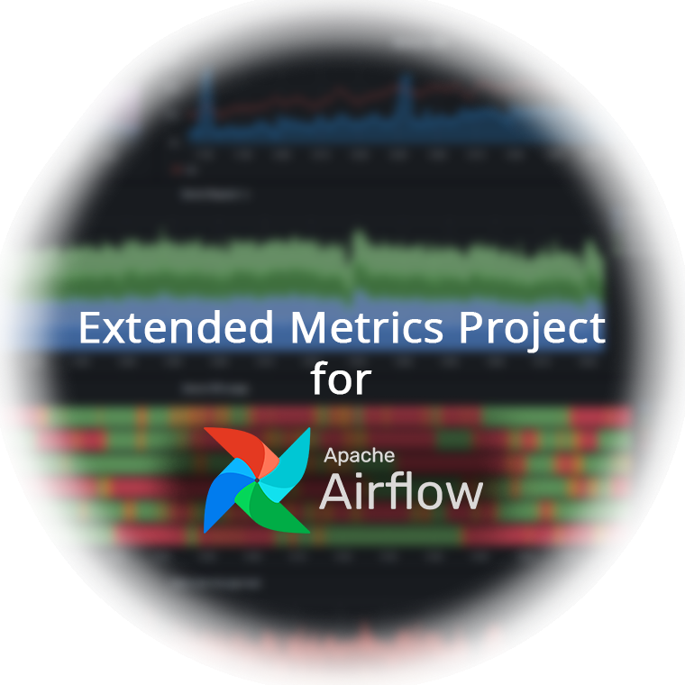

<div id="top"></div>
<!--
*** Thanks for checking out the Best-README-Template. If you have a suggestion
*** that would make this better, please fork the repo and create a pull request
*** or simply open an issue with the tag "enhancement".
*** Don't forget to give the project a star!
*** Thanks again! Now go create something AMAZING! :D
-->

<br />
<div align="center">
  <a href="https://github.com/maseiler/swms-monitoring">
    
  </a>

  <h3 align="center">Extended Metrics Project for Apache Airflow</h3>

  <p align="center">
    Gain more insight in your scientific workflow management system and optimize your workflow execution while minimizing your costs.
    <br />
    <br />
    <a href="https://github.com/maseiler/swms-monitoring/report/final.pdf"><strong>Explore the project report for more detailed information »</strong></a>
    <br />
    <br />
    <a href="https://youtu.be/KWP9V8J-R5Y">View Demo »</a>
    
  </p>
</div>

<!-- ABOUT THE PROJECT -->
## About The Project

This is a repository for the university project "Master Project: Distributed Systems - Monitoring of Scientific Workflows" attended during the summer term 2022 at the Technical University Berlin. In this project we should gain practical experience with so called Scientific Workflow Management Systems (SWMS) and extend existing ones with additional functionalities to give them extra value. In our subproject we extend the SWMS Apache Airflow monitoring capabilities with the following capabilities:

* make use of the Extended Berkeley Packet Filter (eBPF) to get low level kernel space information and process them to gain more insight into the Airflow Tasks

The project should use a semi realistic environment and is therefore settled in the [kubernetes](https://kubernetes.io/de/) ecosystem to reflect the actual real world scenarios with huge workloads in highly distributed systems.  

<p align="right">(<a href="#top">back to top</a>)</p>


<!-- GETTING STARTED -->
## Getting Started

We try to make the deployment as simple as possible and therefore using kubernetes and helm to deploy a working prototype to the Google Cloud Plattform.

To get a copy up and running follow these simple example steps.

### Prerequisites
- Install [kubectl](https://kubernetes.io/docs/tasks/tools/install-kubectl-linux/)
- Install [Helm](https://helm.sh/docs/intro/install/)
- Install and configure [gcloud CLI](https://cloud.google.com/sdk/gcloud/)

### Deploy

Simply run `./setup.sh` in the cloned repository directory.


### Deprovision
> IMPORTANT: Always shut down all instances when you are done working!
> 
Run `./deprovision.sh` to prune all artificats and confirm with `y`.


<p align="right">(<a href="#top">back to top</a>)</p>


<!-- USAGE EXAMPLES -->
## Usage

When deployed the important services are passed through ```kubectl``` to localhost and can be accessed through the following addresses:

- Airflow UI accessible via http://localhost:8080
- Grafana dashboard accessible via http://localhost:3000

The login credentials for the Airflow UI and Grafana are by default the following:

- Username: pjds
- Password: pjds

<p align="right">(<a href="#top">back to top</a>)</p>


<!-- LICENSE -->
## License

Distributed under the MIT License. See `LICENSE.txt` for more information.

<p align="right">(<a href="#top">back to top</a>)</p>


